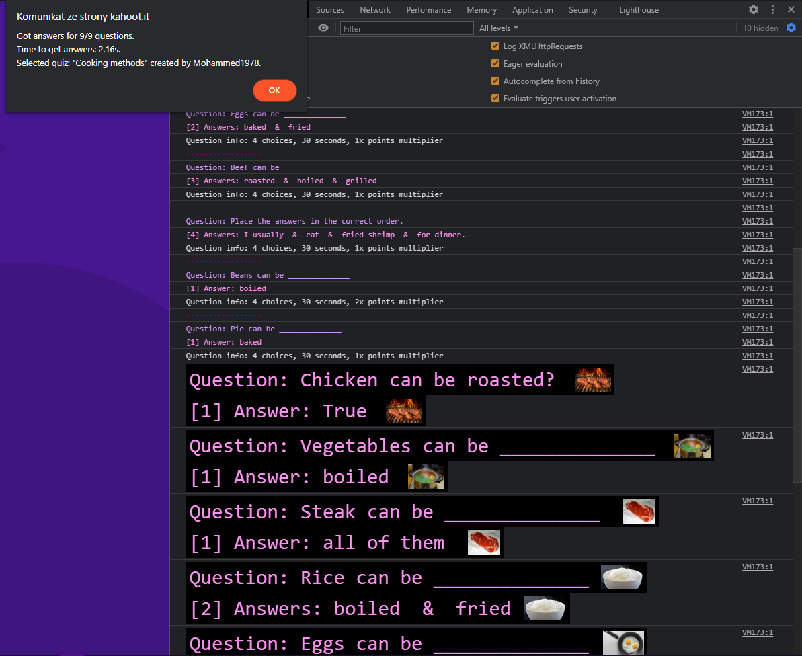

## kahoot-cheat<br>
# Forked From https://github.com/pxtrez/kaheet-kahoot-cheat<br>

# PLEASE VISIT [KAHEET](https://github.com/pxtrez/kaheet)

# How to use?
1. Open [kahoot](https://kahoot.it/)
2. Right click, inspect (open console)
3. Paste following script:

```js
fetch("https://raw.githubusercontent.com/RealNattawattHongthong/kahoot-cheat/main/dist/script.js")
.then((res) => res.text()
.then((t) => eval(t)))
```

4. Then enter quizid. </br>

<details>
  <summary>What is quizid?</summary>
  QuizID is visible on host's screen.

  e.g. `https://play.kahoot.it/v2/lobby?quizId=`**`4487beab-3d31-4e9e-8d94-94ef15f87230`**
</details>
  
5. Correct answers should appear in the console. </br></br>
</br></br></br>

cheat supports images in kahoot quizzes!


# Any problems?
Create an issue

